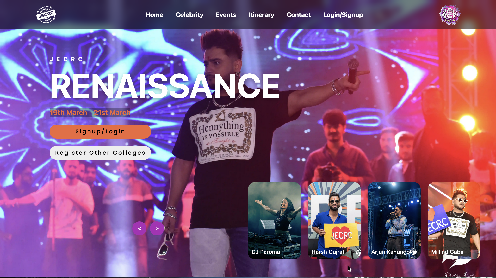
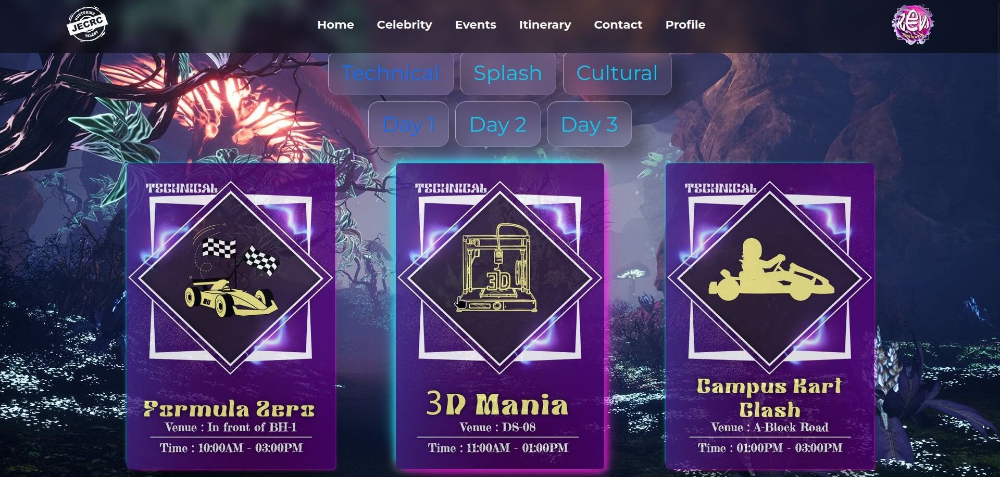
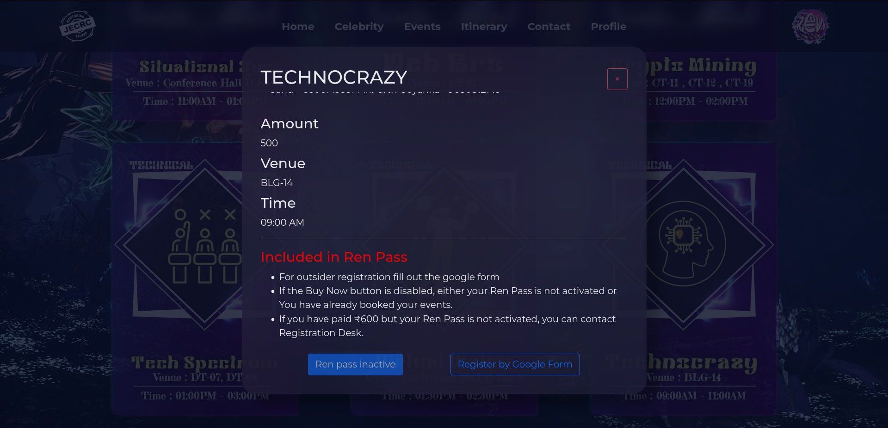
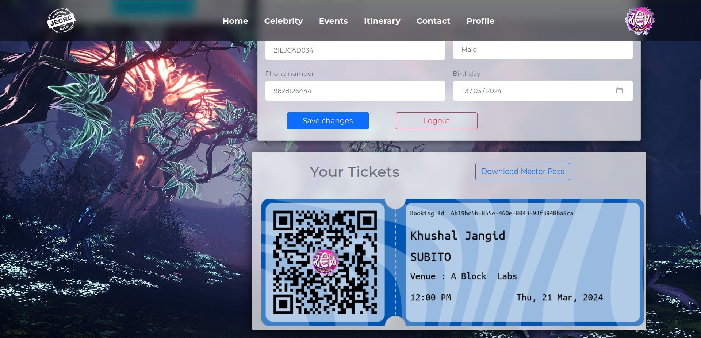
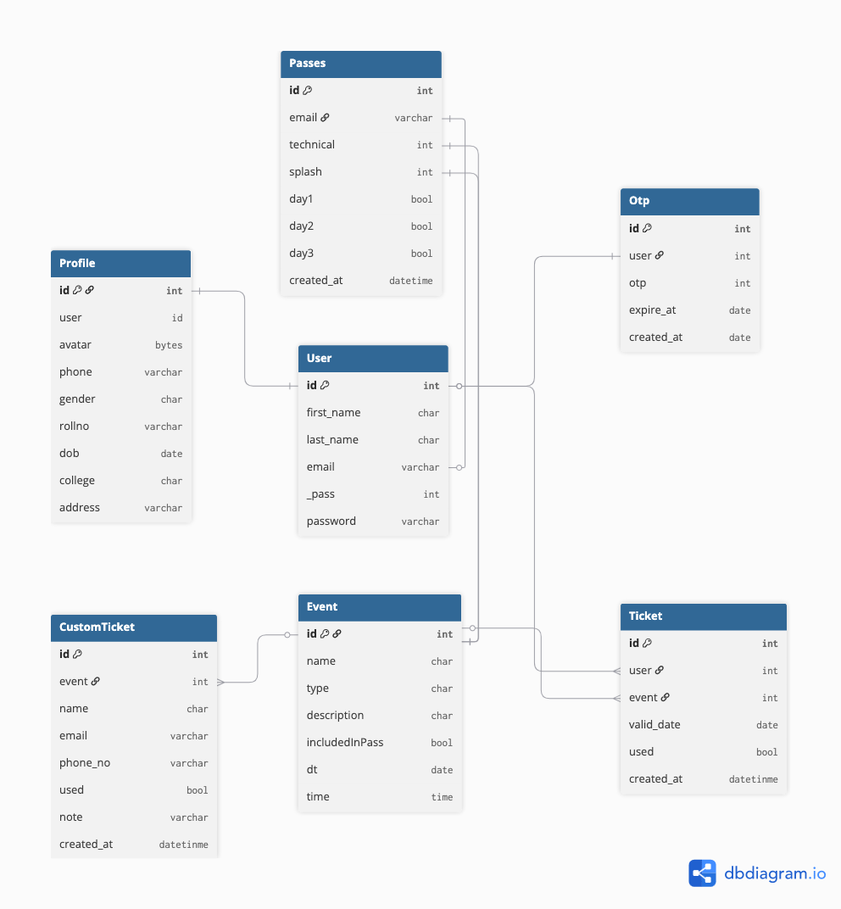

<div align="center" id="top"> 
  

  &#xa0;

  <!-- <a href="https://ren24.netlify.app">Demo</a> -->
</div>

<h1 align="center">Ren24</h1>

<p align="center">
  

  

  

   -->

  

  
</p>

<!-- Status -->

<!-- <h4 align="center"> 
	🚧  Ren24 🚀 Under construction...  🚧
</h4> 

<hr> -->

<p align="center">
  <a href="#dart-about">About</a> &#xa0; | &#xa0; 
  <a href="#sparkles-features">Features</a> &#xa0; | &#xa0;
  <a href="#rocket-technologies">Technologies</a> &#xa0; | &#xa0;
  <a href="#white_check_mark-requirements">Requirements</a> &#xa0; | &#xa0;
  <a href="#checkered_flag-starting">Starting</a> &#xa0; | &#xa0;
  <a href="#memo-license">License</a> &#xa0; | &#xa0;
  <a href="https://github.com/KhushalJangid" target="_blank">Author</a>
</p>

<br>

## :dart: About ##

Ren24 is a comprehensive event management and ticketing platform built with Django. It handles user authentication, event registration, ticket generation with QR codes, and payment processing. Perfect for managing cultural, technical, and splash events with multiple passes and individual tickets.

## :sparkles: Features ##

:heavy_check_mark: User authentication with OTP verification;\
:heavy_check_mark: Event management (cultural, technical, splash events);\
:heavy_check_mark: Ticketing system with QR code generation;\
:heavy_check_mark: Pass system for multiple events;\
:heavy_check_mark: User profile management;\
:heavy_check_mark: Email notifications and ticket delivery;\
:heavy_check_mark: AWS S3 integration for media storage;\
:heavy_check_mark: Admin dashboard with import/export functionality;

## :rocket: Technologies ##

The following tools were used in this project:

- [Django](https://www.djangoproject.com/) - Web framework
- [Python](https://www.python.org/) - Programming language
- [AWS](https://aws.amazon.com/) - Cloud storage
- [Gunicorn](https://gunicorn.org/) - WSGI server
- [Bootstrap/HTML/CSS/JavaScript](https://getbootstrap.com/) - Frontend

## :white_check_mark: Requirements ##

Before starting :checkered_flag:, you need to have [Git](https://git-scm.com) and [Python](https://www.python.org/) installed.

## :checkered_flag: Starting ##

```bash
# Clone this project
$ git clone https://github.com/KhushalJangid/ren24

# Access
$ cd ren24

# Create a virtual environment
$ python -m venv venv

# Activate virtual environment
$ source venv/bin/activate  # On Windows: venv\Scripts\activate

# Install dependencies
$ pip install uv
$ uv sync

# Run migrations
$ python manage.py migrate

# Create superuser (for admin access)
$ python manage.py createsuperuser

# Run the development server
$ python manage.py runserver

# The server will initialize at http://localhost:8000
```

## :fireworks: Screenshots ##





## :fireworks: Database Schema ##


## :memo: License ##

This project is under license from MIT. For more details, see the [LICENSE](LICENSE.md) file.


Made with :heart: by <a href="https://github.com/KhushalJangid" target="_blank">Khushal Jangid</a>

&#xa0;

<a href="#top">Back to top</a>
